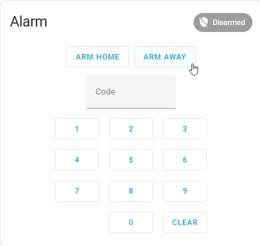
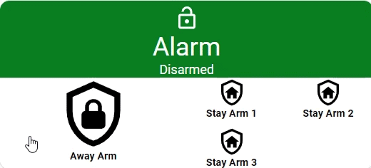
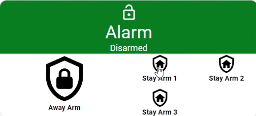
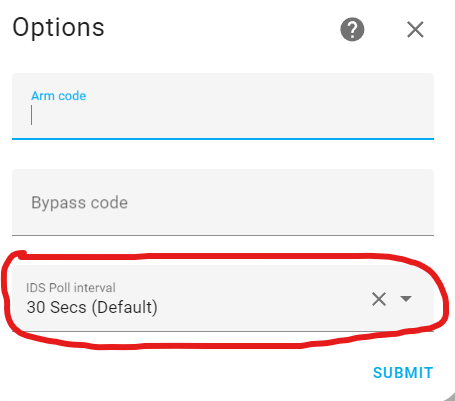
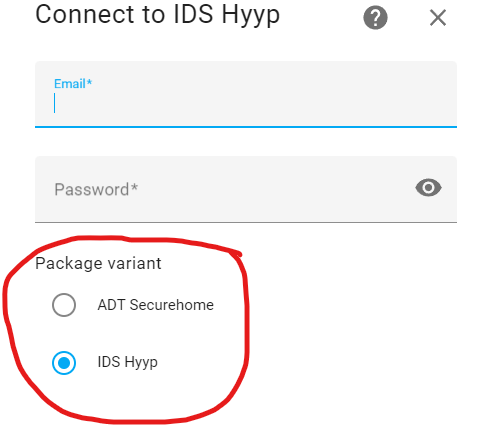

# IDS Hyyp (hawkMod)
IDS Hyyp integration for Home Assistant

# TOC
- [Features](#features)
- [Examples](#examples)
- [Installation](#installation)
- [About](#about)
    - [Requirements](#requirements)
    - [Help](#help)
- [Changelog](#changelog)

# Features

- Supports "Cell phone" type push notifications from IDS. These are the same as the notifications that you'd normally receive on your cellphone with the HYYP App.
    - Push notification summary is shown in `sensor.[site]_ids_push_notifications`.
    - You can for example add a HASS push notification to your phone automation to get "instant" notifications similar to the IDS app.
- Adjustable polling time
    - For use with "GSM Modules"
        *The IDS GSM Modules seem to have a monthly limit of 50MB, and a certain daily limit.*
        - Polling interval can be adjusted to once a day or "Never*" - User can select the value at integration's "Configure"
        - Immediate updates are still done when any action (Arm, disarm, bypass, etc.) is performed
            - Refresh button can also be used for immediate update.
        - *Never is approximately 1 week between polls.
- Refresh button which forces an update from IDS.
    - `button.[site_name]_refresh_button` queues an immediate update from the IDS servers.
- `sensor.[site_name]_ids_poll_interval` shows the current poll time to IDS in seconds. (Useful for GSM users to confirm settings)

- Supports multiple sites and multiple partitions which are linked to your IDS Hyyp account.
- Supports the "Alarm Control Panel" entity which is part of home assistant
- Bypass of individual zones via switch entities
    - Creates a `switch.[zone_name]` switch entity which can be used to toggle zone on/off (bypass).
        - `True` / `ON` : Zone is ON i.e. not bypassed
        - `False` / `OFF` : Zone is OFF i.e. bypassed 
            - This will also show `OFF` if the zone is bypassed when armed as part of a stay profile

    - `switch.[zone_name]` has several attributes which gives further information regarding the zone. 
    *Note that due to the polling time to the IDS server this currently only updates once every 30 seconds as a default. Polling is done since the IDS servers don't have any push implementation for alarm info. These sensor attributes may therefore be up to 30 seconds "late" or "missed".* *For GSM users the updates are per the configurations settings and shouldn't be relied on*
        - `violated` - Will show `True` when a zone is violated for example if a door is open. (Alarm need not be armed)     
            - *The `violated` attribute may be "missed" if for example an unarmed violation occurs on a PIR in-between polls. The "violation" is never shared to or polled by the IDS server. This is IDS's implementation on their panels*
        - `tampered` - Will show `True` when a zone is in tampered state
        - `stay_bypassed` - Will show `True` if a zone is bypassed due to a stay profile being active.
        - `triggered` - Will show `True` when the zone is triggered during armed state i.e. which zone triggered the alarm.
            - The `triggered` attribute is normally `False`.
            - If the alarm triggers, this attribute will turn `True` on the zone that has triggered the alarm.  
            - The sensor will remain `True` for 1 to 2 update cycles (depending on poll timing) and then go back to `False` 
            - *It's recommended you use the `sensor.[site]_ids_push_notifications` if you need "live" data*   
            - *You should handle any home assistant triggers with automations* 
            - *Note multiple sensors can trigger the alarm at the same time if it's armed*

    

            
  
- Multiple stay profiles.  
    *Note that the Home Assistant built in "Alarm Control Panel" entity does not support this, so you will have to create buttons / entity cards etc. to use this feature.*
    - Creates a `button.[site_name]_[partition_name]_[stay_profile_name]` button entity which can be used to arm a specific stay profile. You can also switch between stay profiles while armed in a stay profile.
    - Creates a `sensor.[site_name]_[partition_name]_status` sensor. This sensor provides more detailed feedback regarding the state of the panel. This is similar to the built in `[Alarm Control Panel].status` however it also supports additional stay profile names which the built-in entity does not.
        - Examples of statuses: `Armed`, `Disarmed`, `Triggered`, `Away Armed`, `Armed Stay`, `Armed [Stay_profile_name]`
- IDS "Automations" / "Triggers".  
    *"Automations" is the term used in the IDS app to activate programmable outputs on the panel e.g. to open your gate or garage door. The IDS app also calls it "Triggers"*
    - Creates a `button.[site_name]_[automation_name]` button entity. This entity pushes the "automation" button similar to pushing the button in the IDS app.

      

# Examples
In its most basic form, IDS Hyyp supports the "Alarm Control Panel" entity which is part of Home Assistant.
This allows arming and disarming of partitions by simulating a control panel.
It is however recommended that you build your own interface since the built in Alarm Control Panel doesn't support all the features provided by this integration.

 
You can of course use the entities to create simple buttons and interfaces:

Example of a simple "panel" for away arm

 

Example of a simple "panel" which has multiple stay profiles

# Installation
**HACS Method** 

Get HACS here: (https://hacs.xyz/docs/setup/download/)

Steps in 1-4 Youtube video: **http://www.youtube.com/watch?v=FGoE4XzUE38**

0) DELETE THE OLD VERSION! (If you still have the old Pre 2023.4 version by @RenierM26)
1) Add the following custom repository to HACS: https://github.com/hawky358/hass_ids_hyyp
2) Download the integration using HACS 
3) Restart Home Assistant
4) Add Hyyp integration via Settings > Devices and Services and configure via config flow. 

HACS Method is recommended. If you know how to use SSH or another uploading method, you probably don't need a guide.

# About

## What is this integration
- IDS Hyyp integration is a Home Assistant integration which allows control of IDS alarm panels equipped with the hyyp module.
- The integration works via the existing IDS servers emulating the app.

## What is "hawkMod"

- This integration was originally developed by [@RenierM26](https://github.com/RenierM26/hass_ids_hyyp). 
- With Home Assistant version 2023.4 this integration broke and there was no longer any support or updates from the original developer.
- "hawkMod" is the name of this fork which was created to fix the integration for 2023.4. The name was changed to distinguish it from the original and to prevent any confusion with the original version.
- hawkMod uses a different [modified API](https://github.com/hawky358/pyHyypApi) and has also added several features and bugfixes (See changelog below)

## Requirements

- Requires Home Assistant version 2023.4 and newer.
    - Version 2023.7.3 and newer is recommended.
- Due to the integration connecting to IDS servers, the Home Assistant server requires an internet connection.

## Help
- If you need help or found bugs, please make use of the github discussions or bug report features. I may assist if time permits.
(https://github.com/hawky358/hass_ids_hyyp)

## Disclaimer
- I am not a programmer/developer/coder/etc. I created this fork since I want to continue using this integration. It was broken for me (2023.4), so I fixed it and thought I'd share it so other people can also continue using it.
Support, updates, bugfixes, features, etc. will be limited, but I will help where possible and will share anything I develop.
- This integration is in no way affiliated with IDS. 
    - IDS will not be able to assist with any troubleshooting.

##

 
 

---
# Changelog:

**Version 1.7.2b2**
- Fix an issue where FCM credetials can't be obtained. 
    - Update the FCM notification system to use the Google v1 API

**Version 1.7.1**
- Minor clean-up to the readme.

**Version 1.7.0**

- Implemented a selectable IDS server polling time (30 secods, Once a day, Never) 
    - This was added to provide longer polling times for use with GSM Modules which have a daily/monthly poll/data limit
    - This can be selected at "Configure" of the integration.
    
    

- Added `sensor.[site_name]_ids_poll_interval` which shows the current poll time to IDS in seconds. (Useful for GSM users to confirm settings)

- Added a "Refresh" button `button.[site_name]_refresh_button` which queues an immediate refresh from the IDS servers.
    *(Creating an automation which pushes the refresh button when a push notification is received can be combined with GSM Module low data mode for up to date info while keeping polling to a minimum.)*

- Cleanup of readme and HACS configuration files.

**Version 1.6.1**
- Fixed an issue where alarm panels required entry of code even when configured. (Home Assistant 2024.6.1 introduced a new change requiring alarm panels to enter a code when arming, or to save it in the partition entity).  You may need to restart home assistant after configuring your Arm and bypass codes.

**Version 1.6.0**
- Removed `binary_sensor.[zone_name]_trigger` entity per deprecation notice. This information remains available within the `triggered` attribute in `switch.[zone_name]`

**Version 1.5.4**
- Internal function rename for clarity
- Minor changes to align with ruff guidelines

**Version 1.5.3**

- No longer saving persistent IDs on drive. PIDs will no longer survive a restart, this should fix an issue where specific folder access isn't available on HASS "Container" versions
- Added integration type in manifest (Home assistant deprecating "default")

**Version 1.5.2**

- Final(tm) fix for high cpu usage / infinite loop issue on push notification system

**Version 1.5.1**

- If you are upgrading from 1.5.0 or earlier then you **MUST** re-add the integration to load the new configuration settings.
- Implemented several fixes to the push notification system to prevent infinite loop and high CPU usage
- Implemented better heartbeat and reconnect methods for the push notification system.

**Version 1.5.0**

- Implemented "Cell Phone" type "Push Notifications" 
    - These are similar to the "Notifications" that you receive on your cellphone e.g. when disarming or alarm trigger. 
    - Whenever a new message comes through, the summary is now displayed in `sensor.[site]_ids_push_notifications`
    - Limited testing has been done and reporting method and text may change.
    - You **MUST** restart Home Assistant once after re-adding the integration.

**Version 1.4.1**

- If you are upgrading from  1.3.x or earlier then you **MUST** re-add the integration to load the new configuration settings.
- **`binary_sensor.[zone_name]_trigger` will be removed soon, please update necessary code per below.**
- IDS servers now provide additional zone information which have been added to the integration. This information is shown as an attribute within the zone switch.
    - The `switch.[zone_name]` will now have the following attributes 
        - `violated` - Will show `True` when a zone is violated for example if a door is open. (Alarm need not be armed)
        - `tampered` - Will show `True` when a zone is in tampered state (Not yet verified, by implemented directly from IDS feedback)
        - `triggered` - Will show `True` when the zone is triggered during armed state. This is identical to `binary_sensor.[zone_name]_trigger`. The intent is to have this attribute replace the sensor.
        - `stay_bypassed` - Will show `True` if a zone is bypassed due to a stay profile being active.
- Changed the API refresh requests to series. This makes the replies more reliable when multiple actions are performed.

**Version 1.3.4**
- When a "Stay Profile" is armed the zones which are bypassed as part of this profile will now show as bypassed. i.e. `switch.[zone_name]` will go `OFF` (API Change)
    - Updated API dependancy.
- Fixed issue where previously bypassed zones don't show as bypassed
- Added a fix where system wouldn't load when no notifications are received.

**Version 1.3.3**
- Renamed the options in the config flow during initial setup to be less "obscure"

**Version 1.3.2**
- Fixed a bug where ADT systems wouldn't load due to "triggered zones" not being available from the IDS server. The triggered zone feature (1.3.0) is removed if no trigger information is received (ADT Systems)
- Bumped API dependency to the debug enabled API

**Version 1.3.1**
- Fixed a bug where stay profile buttons wouldn't load if you didn't have any "automations" (Bumped API dependency as this was fixed in the API)

**Version 1.3.0**
- Added Binary sensor which shows which zone triggered the alarm.

    The sensor binary_sensor.[zone_name]_trigger is normally `False`.
    If the alarm triggers this binary sensor will turn to `True` on the zone that has triggered the alarm. 
        (Note multiple sensors can trigger the alarm at the same time if it's armed) 
    The sensor will remain `True` for 1 update cycles and then go back to `False` (You should handle any home assistant triggers with automations)
    The sensor may remain `True` for 2 update cycles depending on how the alarm is synchronized with the update poll.
    Note that due to the polling time to the IDS server this currently only updates once every 30 seconds since there is no push from IDS implemented
- Bumped API dependency

**Version 1.2.2**
- Remove "Beta" from the name, since it doesn't really mean anything at this point.

**Version 1.2.1**
- Fixed a bug where the "Panel" showed disarmed even though the state attribute for the panel showed a "Stay Armed" name. This is a limitation of the home assistant alarm control panel entity. The control panel state attribute has been reverted and no longer has detailed names in the .status attribute.
- The status and name of the armed mode is now contained within a new sensor `sensor.[site]_[partition]_armed_status` and will display the various states e.g.  "Stay Arm 1" or "Stay Arm 2", disarmed etc.

**Version 1.2.0**
- Added the ability to use more than one stay profile
    - If you have more than one stay-profile, there will now be a button entity (and a service) in home assistant for each of the stay-profiles which allows you to arm each of the "Stay-Profiles" and swap between them.
    - When armed to a stay profile, the stay profile name will be shown in the "armed" box.

**Version 1.1.0**
- Added the ability to trigger automations
    - If you've set up any automations/triggers in the IDS app it will now be available as a "button" entity (and a service) in home assistant.

**Version 1.0.1**

- Fixed a bug which wouldn't allow set ups with multiple sites to be added.

**Version 1.0.0**

- Updated version number only
  - The integration is working and I want to start fresh with version numbers
- API Version number also updated and bumped to 1.0.0
- Changed polling to 30 seconds as test. (Don't want to be too aggressive on IDS servers)

**Version 0.0.1.7**

- Updated Readme and allowed for display on HACS

**Version 0.0.1.6** (Main changes from the original [RenierM26](https://github.com/RenierM26/hass_ids_hyyp) version)
- Reverse engineered the pyHyypApi protobuf files and recompiled. (Fixes 2023.4 compatibility) This is not a direct change to ids_hyyp, rather it's a change to the API (https://github.com/hawky358/pyHyypApi)
- Modified dependencies in IDS_HYYP to point to new modified pyhyypapi api package
- Changed name to IDS Hyyp (Beta)(hawkMod) to avoid potential conflicts with previous version
- Works with 2023.4 and higher.

- This is a fork of [francoistk's](https://github.com/francoistk/hass_ids_hyyp) version which was a fork from [RenierM26's](https://github.com/RenierM26/hass_ids_hyyp) original version.
    - [francoistk](https://github.com/francoistk/hass_ids_hyyp) fixed the bug that a stay profile is required for every partition.

